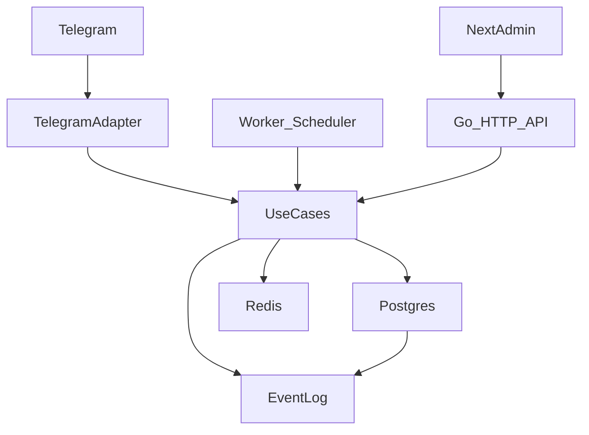

# Technical Plan: PLAN-000 — Platform baseline (stack, arquitetura e padrões)

**Created**: 2026-02-20  
**Spec**: *(cross-cutting baseline; não mapeia 1:1 para uma SPEC)*  
**PRD Base**: §5 (execução/ajuste), §9 (fluxos diários/semanais), §10 (R1–R7), §11 (RNF1–RNF4), §14 (MVP)  
**Related Specs**: `SPEC-003`, `SPEC-011`, `SPEC-015`, `SPEC-016`, `SPEC-002`

## 1) Objetivo do plano
- Definir **stack** e **arquitetura base** (Go backend + Next.js admin) para implementar todas as SPECS com consistência.
- Definir padrões cross-cutting: **idempotência**, **jobs/scheduler**, **event log/métricas**, **feature flags**, **privacidade/retensão** (C1–C5).
- Estabelecer contratos e defaults técnicos que os demais PLANs referenciam (evitando duplicação e conflitos).

## 2) Non-goals (fora do escopo)
- Não implementar nenhuma feature de produto específica (isso fica nos `PLAN-001..PLAN-016`).
- Não fixar fornecedor de cloud; baseline é **compose-first** e portável.
- Não detalhar criptografia/segurança operacional profunda (fica para hardening), mas definir mínimos de privacidade e controles.

## 3) Assumptions (assunções)
- MVP roda em **1 ambiente** com `docker compose`: `api` (Go), `worker` (Go), `db` (Postgres), `redis`.
- O bot é **Telegram-first**; no MVP, a recepção de mensagens pode ser por **long polling** (mais simples) com opção de evoluir para webhook.
- O painel (admin) é um **Next.js app** apenas para visualização/controle (inventário de dados, métricas, estados), consumindo APIs do Go.

## 4) Decisões técnicas (Decision log)
- **D-001 — Backend em Go com arquitetura Hexagonal/Clean**
  - **Decisão**: separar camadas `domain` (entidades/valores), `usecases` (regras), `ports` (interfaces), `adapters` (Telegram, HTTP, DB, Redis).
  - **Motivo**: SPECS exigem regras de negócio ricas e cross-cutting (gates, privacidade, métricas, nudges) com testabilidade alta.
  - **Alternativas consideradas**: MVC monolítico; descartado por acoplamento e dificuldade de evoluir.
  - **Impactos/Trade-offs**: mais “boilerplate” inicial; reduz retrabalho e facilita evolução.

- **D-002 — Next.js como frontend (admin/painel), não como backend**
  - **Decisão**: Next.js App Router para UI, chamando backend Go via HTTP; sem lógica de domínio no Next.
  - **Motivo**: manter 1 fonte de verdade de domínio (Go) e facilitar jobs/scheduler no backend.
  - **Alternativas consideradas**: Next como backend principal; descartado (jobs/nudges e domínio ficariam espalhados).
  - **Impactos/Trade-offs**: exige autenticação simples para o painel; aceitável.

- **D-003 — Postgres + SQL explícito + sqlc**
  - **Decisão**: modelar entidades principais em SQL, queries via sqlc (tipadas), e migrations versionadas.
  - **Motivo**: dados relacionais e auditoria (event log, retenção) com tipagem e previsibilidade.
  - **Alternativas consideradas**: ORM; descartado (menos controle e tipagem de queries).
  - **Impactos/Trade-offs**: exige escrever SQL; melhora clareza e performance.

- **D-004 — Jobs e timeouts via worker + Redis**
  - **Decisão**: separar `worker` para timeouts, nudges e expiração; usar Redis como fila/leasing (ou agendador).
  - **Motivo**: `SPEC-011` requer timeouts e budgets; `SPEC-015` requer expiração; desacoplar do request path.
  - **Alternativas consideradas**: cron puro + DB; aceitável como “Later”, mas Redis dá mais confiabilidade para reintentos.
  - **Impactos/Trade-offs**: adiciona Redis; simplifica execução de jobs e retry.

- **D-005 — Event log como fonte para métricas/agregados**
  - **Decisão**: registrar eventos de domínio mínimos (sem C3) e construir snapshots/agregados (`SPEC-016`).
  - **Motivo**: auditabilidade, observabilidade e cálculo rápido (targets de latência).
  - **Alternativas consideradas**: computar tudo em query ad hoc; descartado (latência e complexidade).
  - **Impactos/Trade-offs**: exige disciplina de eventos; melhora rastreabilidade.

- **D-006 — Privacidade por padrão como “policy engine”**
  - **Decisão**: `PrivacyPolicy` (C1–C5) aplicada no intake (evidência, notas, logs), retenção e respostas (redaction).
  - **Motivo**: RNF4 e `SPEC-015` são mandatórios e cross-cutting.
  - **Alternativas consideradas**: tratar privacidade em cada feature; descartado (inconsistente).
  - **Impactos/Trade-offs**: aumenta complexidade inicial; evita falhas de confiança.

- **D-007 — Idempotência por update do Telegram e por job**
  - **Decisão**: todo processamento de update do Telegram e execução de job usa `idempotency_key` e store de dedupe.
  - **Motivo**: Telegram e jobs podem reentregar; evita duplicar mensagens, estados e contagens.
  - **Alternativas consideradas**: best-effort; descartado (bugs difíceis).
  - **Impactos/Trade-offs**: exige tabela/registro de dedupe; reduz inconsistência.

## 5) Arquitetura (alto nível)
- **Componentes**
  - **TelegramAdapter**: long polling/webhook, parsing de intents, envio de mensagens.
  - **HTTP API (Go)**: endpoints para admin, webhooks (se usar), e consultas rápidas (progresso do dia, inventário de dados).
  - **UseCases**: onboarding, rotina diária, gates, backlog, revisão semanal, privacidade, métricas, nudges.
  - **StorageAdapter (Postgres)**: repositórios + migrations + sqlc.
  - **JobWorker**: timeouts/nudges/expiração/backfill agregados.
  - **Redis**: fila/leasing de jobs e/ou rate limiting.
  - **NextAdmin (Next.js)**: painel web (somente frontend).

- **Fluxos**
  - **Mensagens do usuário**: TelegramAdapter → UseCase → Persistência/Eventos → Resposta Telegram.
  - **Jobs**: Scheduler/Worker → UseCase (timeout/expiração/agregação) → Persistência/Eventos → (opcional) envio proativo (respeitando budgets/quiet hours).

## 6) Contratos e interfaces
- **Envelope de evento (mínimo)**
  - `event_id`, `user_id`, `timestamp`, `local_date`, `week_id`
  - `type`, `payload_min` (sem C3), `sensitivity` (C1/C2/C4/C5)

- **Taxonomia de erro de domínio (padrão)**
  - `VALIDATION_ERROR` (entrada inválida/ausente)
  - `POLICY_BLOCKED` (privacidade/opt-out/modo mínimo)
  - `STATE_CONFLICT` (fora de ordem, concorrência)
  - `NOT_FOUND` (task/session inexistente)
  - `RATE_LIMITED` (budgets/anti-spam)

- **Idempotência**
  - `idempotency_key` para: `telegram_update_id`, `job_run_id`, e comandos “sensíveis” (ex.: apagar dados).
  - store: `IdempotencyRecord(key, first_seen_at, result_ref, expires_at)`.

## 7) Modelo de dados (mínimo)
Entidades centrais (os PLANs de feature detalham domínios).

- **UserProfile** (C5): ids Telegram, timezone/locale, flags de onboarding.
- **PrivacyPolicy** (C5): opt-out, retenção, modo mínimo.
- **DomainEventLog** (C1/C2; sem C3): eventos mínimos para agregação.
- **DailyState** (C1): check-in/plano/status de tarefas (retenção 90d).
- **Gate/Evidence** (`SPEC-003`): resultados e derivados (C2/C4) + evidência C3 curta e opt-out.
- **WeeklyAggregates** (`SPEC-016`) (C4): consistência/rubricas/erros/sono/saúde/autoestima/SaaS (retenção 12m).
- **ProactiveMessageLog / NudgePolicy** (`SPEC-011`) (C1/C5): budgets/quiet hours e logs neutros.

## 8) Regras e defaults
- **Retenção default** (`SPEC-015`/`SPEC-016`)
  - detalhes diários C1/C2: 90 dias
  - agregados C4: 12 meses
  - conteúdo bruto C3: 7 dias (ou “não guardar”)
- **Nudges** (`SPEC-011`): budget 3/dia; 2 por tarefa; intervalo 3h; quiet hours 22–07.
- **Consistência** (`SPEC-016`): meta intensiva conta somente com gate satisfeito (`SPEC-003`).
- **Cooldowns**: overload 7 dias (`SPEC-010`), backlog defer/reject 7 dias (`SPEC-008`).

## 9) Observabilidade e métricas
- **Logs**: estruturados (JSON), com `request_id`, `user_id` (ou hash), `local_date`, `correlation_id`.
- **Eventos**: todos os eventos `SPEC-016` + `SPEC-011` devem existir como `DomainEventLog`.
- **Targets** (`SPEC-016`)
  - Progresso do dia: médio ≤ 5s, p95 ≤ 15s (≤1 mensagem).
  - Revisão semanal: médio ≤ 10s, p95 ≤ 30s (≤2 mensagens).

## 10) Riscos & mitigação
- **Risco**: acoplamento entre bot e regras de domínio.  
  **Mitigação**: ports/adapters e usecases puros.
- **Risco**: duplicação por reentrega (Telegram/jobs).  
  **Mitigação**: idempotência (D-007).
- **Risco**: vazamento de C3 em logs/nudges.  
  **Mitigação**: redaction + classificação + testes de contrato (`SPEC-015`).

## 11) Rollout / migração
- **Feature flags** (config): habilitar módulos gradualmente (`onboarding_v1`, `daily_routine_v1`, `quality_gates_v1`, `nudges_v1`, etc.).
- **Compose-first**: ambiente único para dev e MVP.
- **Migrações**: migrations versionadas; backfill de agregados semanal sob demanda.

## 12) Plano de testes (como validar)
- **Unit**: usecases sem IO (gates, budgets, seleção A/B/C, overload).
- **Integration**: Postgres (migrations + sqlc), Redis (jobs), Telegram adapter (parsing e idempotência).
- **E2E**: fluxo diário e nudges com scheduler em ambiente compose.
- **Manual / acceptance**: privacidade (“o que guarda?” / apagar), e anti-spam (budgets/quiet hours).

## 13) Task breakdown (execução)
1) **Definir estrutura de serviços (API/Worker) e boundaries hexagonais**
   - **Entrada**: baseline D-001/D-004
   - **Saída**: convenção de módulos/pacotes e contratos ports/adapters (documentado)
   - **Critério de pronto**: todos os PLANs conseguem apontar para onde “mora” cada responsabilidade

2) **Definir modelo base (UserProfile, PrivacyPolicy, EventLog, IdempotencyRecord)**
   - **Entrada**: `SPEC-015`/`SPEC-016`
   - **Saída**: schema lógico + retenção por categoria
   - **Critério de pronto**: C1–C5 explícitos e expiração planejada

3) **Definir e padronizar envelope de eventos + reason codes**
   - **Entrada**: `SPEC-016` + `SPEC-011`
   - **Saída**: contrato de evento e lista de types mínimos
   - **Critério de pronto**: todos os PLANs conseguem emitir/consumir eventos sem conteúdo sensível

4) **Definir estratégia de idempotência (Telegram + jobs)**
   - **Entrada**: D-007
   - **Saída**: regras de chave, expiração e comportamento em duplicatas
   - **Critério de pronto**: “no duplicate sends” e “no duplicate state transitions”

## 14) Open questions (se existirem)
- (Default adotado) **Polling vs webhook**: MVP usa long polling (menos infra). Se você preferir webhook + TLS desde o início, o baseline deve ser ajustado (reverse proxy + certificados).

